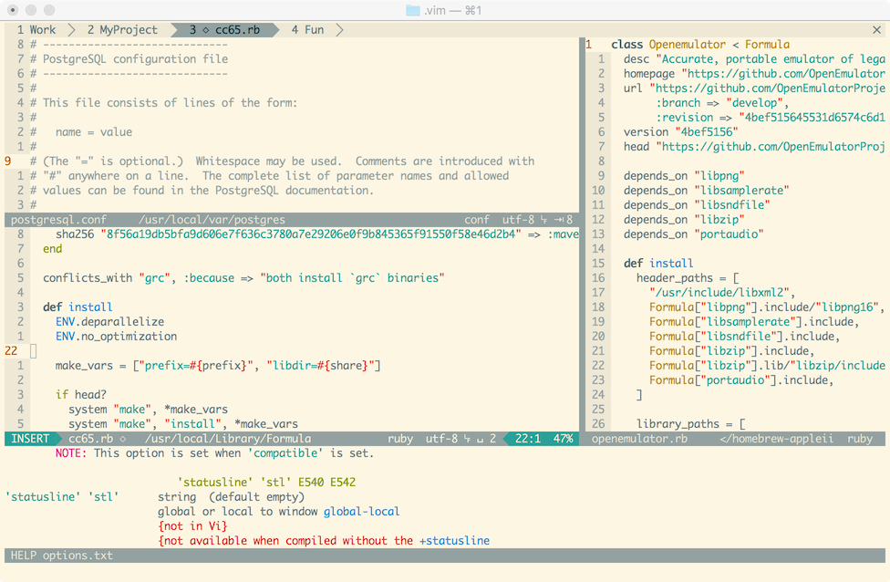

## My Vim setup

This repository contains my own Vim setup, which includes a `vimrc` file and
a few plugins (as Git submodules).

The default theme is [Solarized
8](https://github.com/lifepillar/vim-solarized8). To use a different theme, put
a file called `vimrc_local` inside `.vim` and load your color scheme there.

### Requirements

- A fairly recent Vim (7.4 or later) (`brew install vim` recommended on OS X).

Recommended:

- Vim 8.
- [The Silver Searcher, aka Ag](https://github.com/ggreer/the_silver_searcher)
  (`brew install ag` on OS X).
- [Exuberant ctags](http://ctags.sourceforge.net) to use Tagbar (`brew install ctags` on OS X).

### Installation

    cd
    git clone --recursive https://github.com/lifepillar/vimrc.git .vim
    cd .vim
    git checkout -b local

…and tweak to your taste!

### Update

    cd ~/.vim
    git checkout master
    git pull origin master
    git submodule sync
    git submodule update --init --recursive
    git checkout local
    git rebase master

…and fix conflicts.

### Update plugins

Make sure the repo is in a clean state.

    git submodule update --remote
    git commit -a
    git submodule update --recursive

Explanation: the first command retrieves the latest commit of each submodule;
the second command updates the references to the submodules; finally, the
last command ensures that plugins's submodules, if any, are synchronized with
the corresponding plugin (see, for example, YouCompleteMe).

### How to add a new plugin or colorscheme

To add a plugin `Foo` from `https://repo/foo`:

    git submodule add --name foo https://repo/foo pack/bundle/start/foo

To add `Foo` as an optional plugin, change `start` with `opt` (it works if Vim
has packages, otherwise you also have to add the plugin to
`g:pathogen_blacklist`).

To add a colorscheme, change `bundle/start` with `themes/opt`.

You may use `--depth 1` to create a shallow clone, but [beware of shallow
submodules](http://stackoverflow.com/questions/27188899/shallow-clone-with-submodules-in-git-how-to-use-pointed-commits-and-not-latest).

###  Some features

- A 40-column **cheat sheet** always at hand with `\?` (courtesy of
  [Cheat40](https://github.com/lifepillar/vim-cheat40)).
- Foldable and thoroughly commented `vimrc`.
- **Distraction-free mode** (courtesy of
  [Goyo](https://github.com/junegunn/goyo.vim) and
  [Limelight](https://github.com/junegunn/limelight.vim)).
- Handcrafted, collapsible, fully customizable, **"plugin-free" status line**
  (let Vim spend a few tens of microseconds on updating the status line rather
  than the several milliseconds that plugins “as light as air” need). It used to
  support Powerline fonts up to commit
  [ca915737](https://github.com/lifepillar/vimrc/commit/ca9157376be876b030e5306adf38efd7093b870a),
  when I decided that simple is better (and Powerline fonts are an ugly hack
  anyway).
- Etc... (read the cheat sheet and the source!)

### Useful resources

Apart from the obvious ones (e.g., [vim.wikia.com](http://vim.wikia.com)), I
have found the following (in)valuable:

- [usevim](http://usevim.com/)
- [VimGolf](http://vimgolf.com)
- [VimAwesome](http://vimawesome.com)
- [vimrcfu](http://vimrcfu.com)
- [vim-galore](https://github.com/mhinz/vim-galore)
- [vimcolors](http://vimcolors.com)

