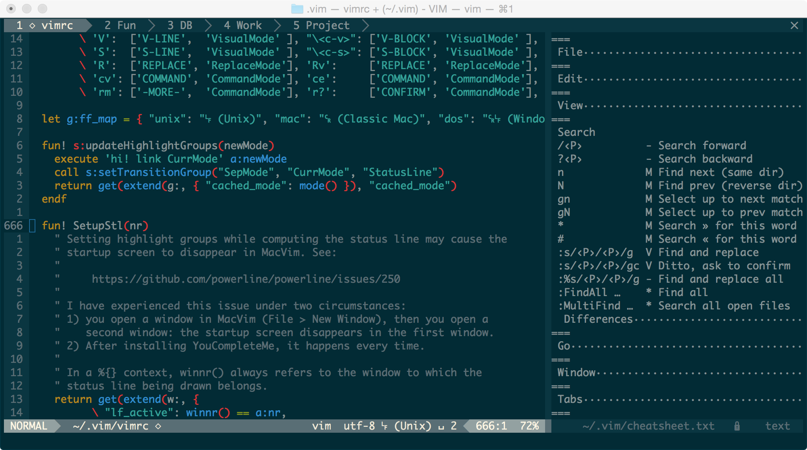
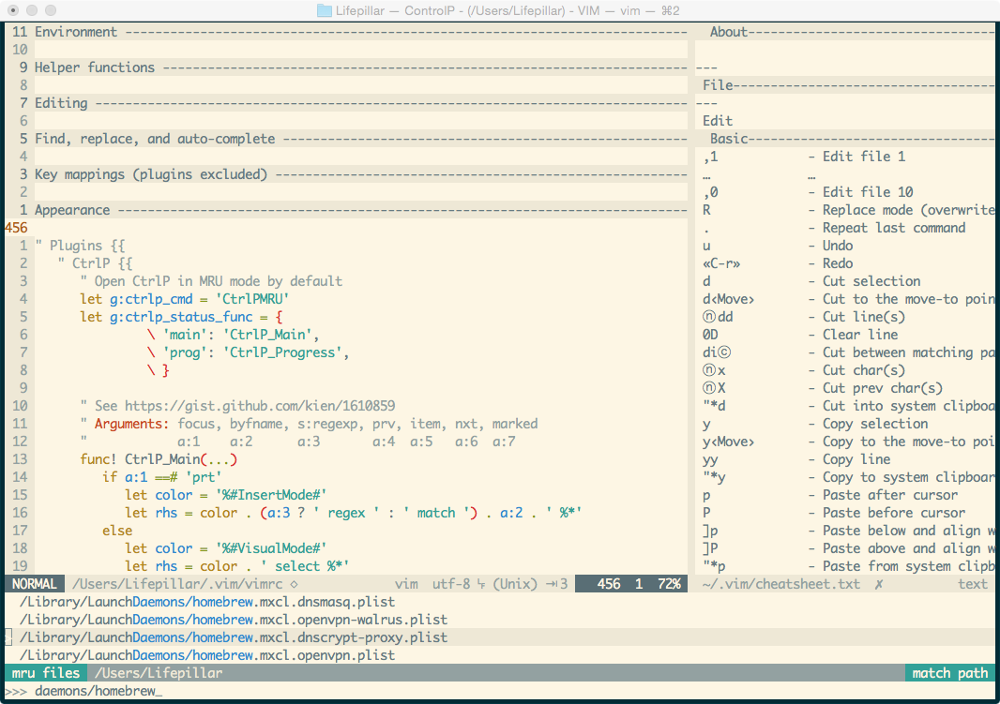

## My Vim setup

This repository contains my own Vim setup, which includes a `vimrc` file and a
few plugins (as Git submodules). This configuration is mostly built from other
people's code and ideas, but I haven't kept track of my many sources of
inspiration. If you feel that I should cite the source of some snippet, please
let me know! Note that I use this on OS X: minor modifications might be
necessary for other systems.

### How it looks like

### Requirements

- A fairly recent Vim (7.3 or later) (`brew install vim` recommended on OS X).
- [Exuberant ctags](http://ctags.sourceforge.net) to use Tagbar (`brew install ctags` on OS X).

### Installation

    cd
    git clone --recursive https://github.com/lifepillar/lifepillar-vim-config.git .vim
    cd .vim
    mkdir tmp
    git checkout -b local

…and tweak to your taste!

### Update

    cd ~/.vim
    git checkout master
    git pull origin master
    git checkout local
    git rebase master

…and fix conflicts.

### Update plugins

    git submodule update --remote

###  Some features

- A *cheat sheet* always at hand with `,cs`.
- Foldable and thoroughly commented `vimrc`.
- Leader set to `,` (comma).
- Enter command mode with `;` instead of `:` for convenience.
- Uses *Solarized theme* by default (toggle dark/light background with `F7`).
- *Distraction-free mode* (toggle with `,F`).
- Keeps the edited line vertically centered.
- Handcrafted, collapsible, *"plugin-free" status line*.
- Toggle hard/soft tabs with `,t` (default: soft tabs).
- Increase/decrease tab width with `,[` and `,]`, respectively.
- Toggle invisibles with `,i`.
- Toggle spell-checking with `,s`.
- Select all with `,A`.
- Remove all trailing spaces with `,ts`.
- Hard-wrap paragraphs with `,r`.
- Key bindings in command mode similar to those used by the shell.
- Etc... (read the cheat sheet and the source!)

