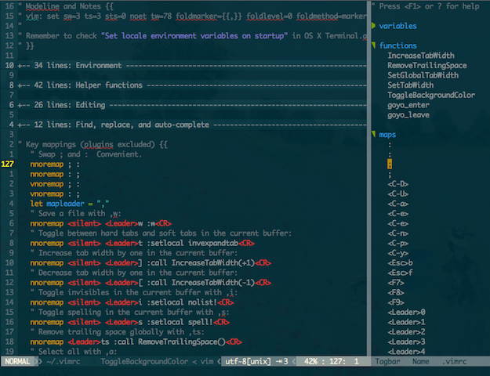

## My Vim setup

This repository contains my own Vim setup, which includes a `vimrc` file and a
few plugins (as Git submodules). This configuration is mostly built from other
people's code and ideas, but I haven't kept track of my many sources of
inspiration. If you feel that I should cite the source of some snippet, please
let me know! Note that I use this on OS X: minor modifications might be
necessary for other systems. 

### Requirements

- A fairly recent Vim (7.3 or later) (`brew install vim` recommended on OS X).
- [Exuberant ctags](http://ctags.sourceforge.net) to use Tagbar (`brew install ctags` on OS X).

### Installation

    git clone https://github.com/lifepillar/lifepillar-vim-config.git ~/.vim
    cd ~/.vim
    git submodule init
    git submodule update
    mkdir tmp
    git checkout -b local

…and tweak to your taste!

### Update

    git checkout master
    git pull origin master
    git checkout local
    git rebase master

…and fix conflicts.

###  Some features

- Foldable and thoroughly commented `vimrc`.
- Leader set to `,` (comma).
- Enter command mode with `;` instead of `:` for convenience.
- Uses Solarized theme by default (toggle dark/light background with `F7`).
- Distraction-free mode (toggle with <leader>`F`).
- Keeps the edited line vertically centered.
- Airline status line extended to show tab width and type, and BOM flag.
- Toggle hard/soft tabs with <leader>`t` (default: hard tabs).
- Increase/decrease tab width with <leader>`[` and <leader>`]`, respectively.
- Copy/paste to/from system clipboard by default.
- Toggle invisibles with <leader>`i`.
- Toggle spell-checking with <leader>`s`.
- Select all with <leader>`a`.
- Remove all trailing spaces with <leader>`ts`.
- Hard-wrap paragraphs at text width with <leader>r.
- Key bindings in command mode similar to those used by the shell.
- Etc... (read the source!)

### How it looks like

